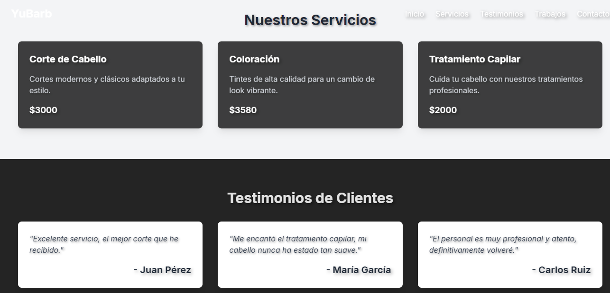
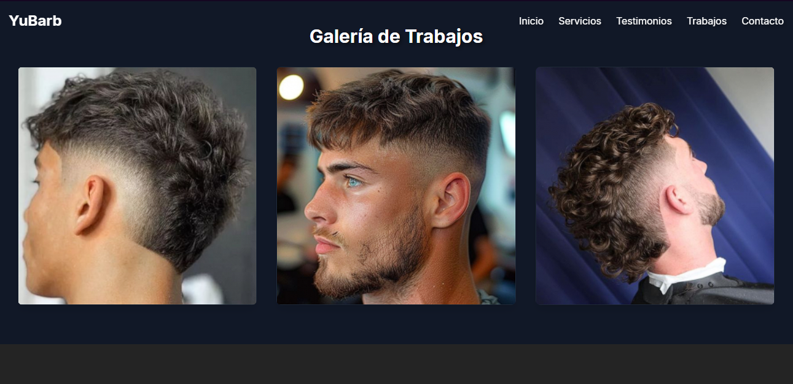
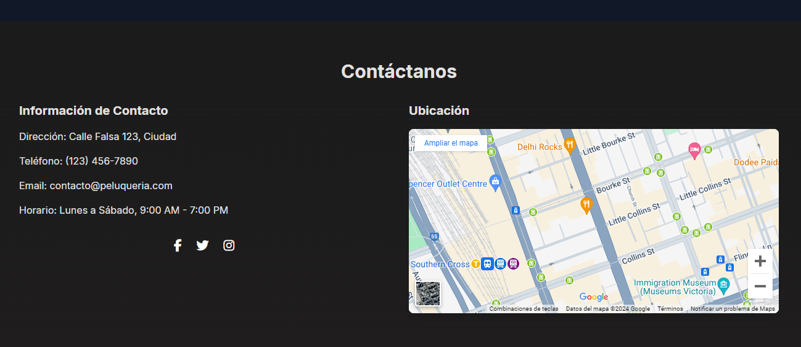

# Peluquería Online

¡Bienvenido a la página web de nuestra peluquería online! Aquí puedes reservar tus citas y conocer más sobre nuestros servicios de cuidado personal.

## 🚀 Despliegue

Este proyecto está desplegado en GitHub Pages. Puedes acceder a la página en el siguiente enlace:

- **URL del sitio web:** [https://imanolbraccciale.github.io/peluqueria/]

## 🛠️ Tecnologías Utilizadas

- **Vite**: Herramienta de desarrollo para proyectos front-end.
- **React**: Biblioteca de JavaScript para construir interfaces de usuario.
- **TypeScript**: Un superconjunto de JavaScript que agrega tipos estáticos.

## 📦 Scripts Disponibles

En este proyecto, puedes ejecutar los siguientes comandos:

### `npm run dev`

Compila la aplicación para producción en la carpeta `dist`.

### `npm run deploy`

Despliega la aplicación en GitHub Pages.

## 🖼️ Capturas de Pantalla
Inicio
 

 Servicios y testimonios 
 

 Galeria
 
 
Contáctanos
 

## 📄 Licencia

Este proyecto está bajo la licencia MIT.
